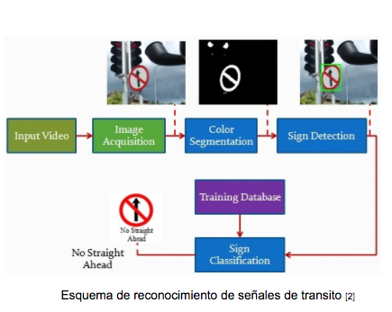
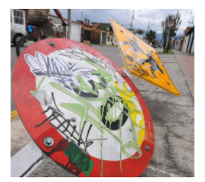
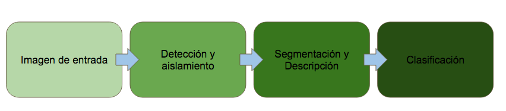
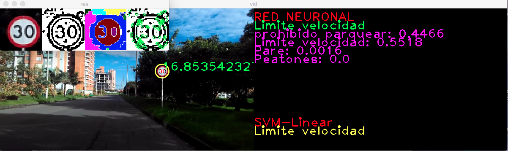

# TSR-Colombia

Proyecto para materia Vision de maquina, detector de señales de transito colombianas usando tecnicas de vision de maquina.

## Reconocimiento de señales de tránsito colombianas
Sergio Alejandro Diaz Pinilla

### Motivación
El reconocimiento de señales de tránsito, permitiría un desarrollo de las siguientes actividades.

Asistencia del conductor
Información para conducción autónoma.
Cumplimiento de las señales de tránsito Permitiendo así una mejor conducción en las vías y previniendo accidentes causados por ignorar las señales de tránsito.
Contexto
Los ADAS son un sistema que está diseñado para aumentar la seguridad de vehículo mediante mecanismos como informar al conductor de peligros o tomar el control de este en emergencias. Uno de los sistemas que usan estos sistemas es el reconocimiento de señales (TSR) , para recopilar información de la carretera.

Uno de los sistemas que usan estos sistemas es el reconocimiento de señales (TSR) , para recopilar información de la carretera. Los TSR se dividen en dos componentes, el sistema detector y el reconocedor .

En colombia hay 4 tipos de señales de tránsito:

 * Preventivas
* Reglamentarias
* Informativas
* Señales del piso Las señales de tránsito en colombia son regidas por el código nacional de tránsito.

Algunas de las señales de tránsito no tienen un buen mantenimiento o son vandalizadas. Estas actividades pueden dificultar el reconocimiento de estas.
No existe base de datos de las imágenes (Señales en Colombia) por lo cual se recopilaron la imágenes de estas señales.

### Proceso
A continuación se vera la solución propuesta.

### Resultado

